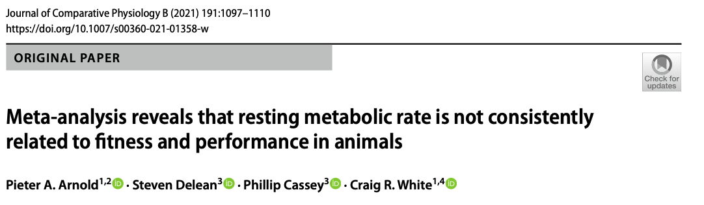

# Publication Bias: Analytical Approaches

```{r}
#| echo: false
#| message: false
#| warning: false

# Load packages
pacman::p_load(metafor, clubSandwich, flextable, tidyverse, orchaRd, pander, mathjaxr, equatags, magick)
options(digits=3)
```

## **Analytical Approaches for Assessment of Publication Bias in Meta-analysis**

In the [last tutorial](pub-bias1.qmd) we talked about one of the most common visual tools for assessing whether publication bias might be present, funnel plots [@Jennions2013; @Nakagawa2021b; @Rothstein2005]. However, how do we know for sure if publication bias is actually going to be a problem? Do we have less subjective tools that can both quantitatively test and correct for the possibility of publication bias? The short answer is, we do! The caveat being here that these are still not definitive proof for publication bias and we must keep that in mind. Any results from publication bias tests should be interpreted with caution and viewed as sensitivity analyses [@Noble2017; @Koricheva2013] because we will never truly know how many missing effect sizes actually exist.

In this tutorial, we'll walk through three complementary analytical tools that together provide a more defensible picture of whether publication bias is shaping our conclusions:

1. **Multilevel Egger-type regression** -- including the sampling error as a moderator in a multilevel meta-regression to test for small-study effects and obtain an "adjusted" meta-analytic mean [@Nakagawa2021b; @Stanley2014].
2. **Time-lag bias tests** -- including publication year as a moderator to test whether effect sizes are shrinking over time, one form of the "decline effect" [@Nakagawa2021b].
3. **Bias-robust weighting with cluster-robust variance estimation** -- a recent two-step framework from @Yang2024 that simultaneously tackles selective reporting and non-independence, which @Yang2024 show can jointly inflate effect sizes by over 100% and deflate standard errors by over 120% when ignored.

No single test is definitive, and each rests on assumptions that can fail in ecological data. The point is to triangulate: if several complementary approaches tell the same story, we can have more confidence in our conclusions.

## **Statistically Testing and Correcting for Publication Bias**
### Introduction



We're now going to expand upon the meta-analysis by @Arnold2021 to explore more rigorously whether publication bias is present, and if so, try and re-interpret effects as if such bias did not actually exist. 

### Download the Data

```{r}
#| label: rawdata
#| message: false
#| warning: false

# Packages
pacman::p_load(tidyverse, metafor, orchaRd)

# Download the data. Exclude NA in r and sample size columns
arnold_data <- read.csv("https://raw.githubusercontent.com/pieterarnold/fitness-rmr-meta/main/MR_Fitness_Data_revised.csv")

# Exclude some NA's in sample size and r
arnold_data <- arnold_data[complete.cases(arnold_data$n.rep) & complete.cases(arnold_data$r),]

# Calculate the effect size, ZCOR
arnold_data <- metafor::escalc(measure = "ZCOR", ri = r, ni = n.rep, data = arnold_data, var.names = c("Zr", "Zr_v"))

# Lets subset to endotherms for demonstration purposes
arnold_data_endo <- arnold_data %>% 
               mutate(endos = ifelse(Class %in% c("Mammalia", "Aves"), "endo", "ecto")) %>% 
               filter(endos == "endo" & Zr <= 3) # Note that one sample that was an extreme outlier was removed in the paper.

# Add in observation-level (residual) 
arnold_data_endo$obs <- 1:dim(arnold_data_endo)[1]
```

### Meta-regression Approaches to Publication Bias 

@Nakagawa2021b [building off of work by @Stanley2012; @Stanley2014] outline a method for testing and accounting for publication bias using multilevel meta-regression approaches. Here, we include sampling standard error (SE) (and variance -- V) directly as a moderator in our meta-regression model. We can test explicitly test whether sampling SE and V significantly explain variation in our effect size. To be more explicit, we can adjust our multilevel meta-regression model as follows:

$$
\begin{aligned}
y_{i} &= \mu + \beta_{se}se +  s_{j[i]} + spp_{k[i]} + e_{i} + m_{i} \\
m_{i} &\sim N(0, v_{i}) \\
s_{j} &\sim N(0, \tau^2) \\
spp_{k} &\sim N(0, \sigma_{k}^2) \\
e_{i} &\sim N(0, \sigma_{e}^2)
\end{aligned}
$$

Of course, we could also include a suite of other moderators in our analysis to also account for more heterogeneity like we have shown in [past tutorials](metaregression.qmd):

$$
y_{i} = \mu + \sum_{i = 1}^{N_{m}}\beta_{m}x_{m} + \beta_{se}se +  s_{j[i]} + spp_{k[i]} + e_{i} + m_{i} \\
$$
Here, $\beta_{m}$ is the slope (or contrast) for the $m^{th}$ moderator (where m = 1, ..., $N_{moderator}$ or $N_{m}$). Of course, $\beta_{se}se$ can be included in this term, but for clarity we separate it out to be clear SE or V is included as a moderator in addition to other moderators. @Stanley2012 and @Stanley2014 have shown that when $\mu$ in a model that estimates $\beta_{se}$ is significant than the intercept (in this case, $\mu$) provides the best estimate of an adjusted meta-analytic that accounts for the possibility of publication bias [@Nakagawa2021b] [see correction for original paper @Nakagawa2022cor]. However, @Stanley2012 and @Stanley2014 have shown that when $\mu$ is significant than including SE is best replaced with the sampling variance (i.e., $SE^2$) instead because the intercept using SE is downwardly biased. 

As such, @Nakagawa2021b recommend a two step approach. First fitting a model with SE. If the intercept of that model is significant than re-fitting the model using V (or $SE^2$) as this will give us a better estimate of the adjusted mean effect size.

#### **Why does including sampling variance in the model adjust the overall meta-analytic mean?**

::: {.panel-tabset}

## Task!

>**Think about how the intercept, $\mu$, changes its meaning when a continuous moderator, such as $se$, is included in the model. When estimating $\beta_{se}$ explicitly how do we now interpret the intercept or meta-analytic mean?**

<br>

## Answer!

>The reason why the intercept ($\mu$) is an adjusted meta-analytic mean is because when we include a continuous moderator the intercept itself takes on a different meaning. For example, if we fit the multilevel meta-regression model using SE than the intercept estimated in that model is the overall meta-analytic mean when the SE is zero. Or, in other words, when there is **no** sampling variability or uncertainty around the estimate. We can see that this is true by setting SE = 0 in the equation:

$$
y_{i} = \mu + \beta_{se}*0  =
\mu  \\
$$

:::

<br>

### Fitting a Multi-level Meta-Regression model to Test and Correct for Publication bias

Let's now apply the methods proposed above to @Arnold2021's data. To simplify, we are just going to remove other moderators and only fit SE and/ or V. This just simplifies the interpretation of the intercept, but we could always include the fitness trait type moderator in these models as well. 

```{r}
#| echo: true

# Including sampling standard error as moderator
metareg_se <- rma.mv(yi = Zr, V = Zr_v, mods = ~ sqrt(Zr_v), test = "t", dfs = "contain", data = arnold_data_endo, random = list(~1|Ref, ~1|obs))
summary(metareg_se)
```

We'll also fit the model with sampling variance for good measure, but given that the `intrcpt` is not significant we can interpret the first model.

```{r}
#| label: V
#| echo: true

# Including sampling variance as moderator
metareg_v <- rma.mv(yi = Zr, V = Zr_v, mods = ~ Zr_v, test = "t", dfs = "contain", data = arnold_data_endo, random = list(~1|Ref, ~1|obs))
summary(metareg_v)
```

#### **Interpreting the results**

::: {.panel-tabset}

## Task!

>**Is there evidence for publication bias? If so, what is the adjusted meta-analytic mean estimate?**

<br>

## Answer!

>Yes, there is evidence for publication bias because the slope estimate for `sqrt(Zr)` or the sampling standard error is significant. Given that the `intrcpt` is not significant we can interpret the model using SE instead of V. We can see from this model that the adjusted `Zr` when there is *no* uncertainty is `r metareg_se$b[1]`with a 95% confidence interval that overlaps zero (i.e., 95% CI = `r metareg_se$ci.lb[1]` to `r metareg_se$ci.ub[1]`). In other words, if no uncertainty around estimates exists, or we have a very high powered set of studies than we would expect the correlation to be, on average, `r tanh(metareg_se$b[1])`. 

:::

<br>


::: {.callout-caution}
### A note on effect size choice

The above approach works cleanly for Fisher's $Z_r$ because the sampling variance of $Z_r$ depends only on sample size, not on the effect size itself. For standardised mean differences (SMD / Hedges' $g$) and log response ratios (lnRR), the sampling variance is mathematically coupled to the point estimate, so using $\sqrt{v}$ as a moderator can induce a spurious slope even when there is no publication bias at all [@Nakagawa2021b]. @Nakagawa2021b therefore recommend using a transformation of the *effective sample size* as the moderator instead of $\sqrt{v}$ when working with SMD or lnRR. For SMD and lnRR a good default is:

$$
\text{moderator} = \sqrt{\frac{\tilde{n}_{1} + \tilde{n}_{2}}{\tilde{n}_{1}\tilde{n}_{2}}},
$$

where $\tilde{n}_{1}$ and $\tilde{n}_{2}$ are the per-group sample sizes. This is proportional to the "design-based" sampling standard error but does not depend on the observed effect size. In `metafor` this simply means replacing `sqrt(Zr_v)` in the `mods =` argument with the precomputed moderator column.
:::

### (2) Testing for Time-lag Bias

Another useful diagnostic asks whether effect sizes are *shrinking over time* -- a pattern often called a **time-lag bias** or **decline effect** [@Nakagawa2021b; @Jennions2013]. The intuition is that for early studies addressing a research question, large and significant results are disproportionately likely to be published first (because they are "exciting", or simply easier to write up and accept). As the field matures, smaller and null results catch up, and the apparent effect size decays. We can test this directly by including publication year as a moderator in the multilevel model. To make the intercept interpretable as the mean effect at the *average* publication year, we mean-centre year first. However, publication year could be centered on any year of interest. 

```{r}
#| label: timelag
#| echo: true

# Mean-centre publication year so the intercept is the effect at the mean year
arnold_data_endo$year_c <- arnold_data_endo$Year - mean(arnold_data_endo$Year)

metareg_year <- rma.mv(yi = Zr, V = Zr_v,
                        mods = ~ year_c,
                        test = "t", dfs = "contain",
                        data = arnold_data_endo,
                        random = list(~1|Ref, ~1|obs))
summary(metareg_year)
```

We can also fit a combined model that tests for small-study effects and time-lag bias *simultaneously*, which is the model advocated by @Nakagawa2021b:

```{r}
#| label: eggeryear
#| echo: true

metareg_full <- rma.mv(yi = Zr, V = Zr_v,
                        mods = ~ sqrt(Zr_v) + year_c,
                        test = "t", dfs = "contain",
                        data = arnold_data_endo,
                        random = list(~1|Ref, ~1|obs))
summary(metareg_full)
```

#### **Interpreting the time-lag test**

::: {.panel-tabset}

## Task!

>**Look at the slope for `year_c` in the combined model. Is there evidence that effect sizes in the Arnold dataset have changed systematically over time? How would you report this alongside the small-study effect test?**

<br>

## Answer!

>A significant *negative* slope on `year_c` would indicate a decline effect: more recent studies report smaller $Z_r$ values than older ones. A *positive* slope would suggest the opposite -- that earlier studies underestimated the effect. A slope that is indistinguishable from zero means there is no detectable time-lag bias, and the intercept (at the mean year) is a reasonable summary of the long-term average effect. Because both $\sqrt{v}$ and `year_c` are included simultaneously, each slope tests for its own bias *after adjusting* for the other, which is useful because time-lag and small-study effects can be partially confounded (early studies were often smaller).

:::

<br>

### (3) Bias-robust Estimation with Dependent Effect Sizes

The approaches above all rely on **inverse-variance weighted** estimation, which, for a multi-level model is $1/v_i + tau^2$. @Yang2024 point out two problems with this when selective reporting is present:

1. **Inverse-variance weighting including $tau^2$ amplifies selective reporting.** In essence, when between study heterogeneity is large it dominates the weights and the model no longer protects against small-study effects. This is because the weights are no longer primarily determined by sampling variance, so the smallest-variance studies no longer receive disproportionate weight. In fact, when $tau^2$ is large, the weights become more similar across studies, which can actually *reduce* the impact of selective reporting on the pooled mean. However, this also means that the model is less sensitive to detecting small-study effects through the $\sqrt{v}$ moderator, and it can lead to underestimation of the true effect size if smaller studies with larger effects are overrepresented in the literature.
2. **Standard parametric SEs assume independence.** Clustered effect sizes (multiple effects per study, phylogenetic clustering, shared controls) inflate type-I error rates even after including random effects, because the working covariance structure is rarely specified perfectly.

@Yang2024 re-analysed 448 ecological and evolutionary meta-analyses and showed that the *joint* impact of these two problems can be substantial: on average, effect sizes are overestimated and standard errors are underestimated when both are ignored. They propose a simple **two-step procedure**:

- **Step 1 -- bias-robust point estimation.** Refit the meta-analytic model with a weighting scheme that does *not* depend on the sampling variance. A simple and defensible choice is to use *equal* (unit) weights, which in `rma.mv` is done by passing a constant vector via the `W =` argument. The resulting pooled mean is far less sensitive to selective reporting because small, potentially cherry-picked studies no longer receive disproportionate weight.
- **Step 2 -- cluster-robust variance estimation (CRVE).** Wrap the fitted model in `clubSandwich::coef_test()` (or equivalently `metafor::robust()`) with `cluster =` set to the study ID. This produces sandwich-type standard errors and confidence intervals that remain valid even if the working random-effect structure is misspecified.

Let's apply this to the Arnold endotherm data. We'll compare the naive multilevel estimate, the $\sqrt{v}$-adjusted Egger estimate, and the bias-robust estimate with CRVE.

```{r}
#| label: biasrobust
#| echo: true
#| message: false
#| warning: false

# (a) Naive multilevel meta-analytic mean (inverse-variance weighted)
mod_naive <- rma.mv(yi = Zr, V = Zr_v,
                     test = "t", dfs = "contain",
                     data = arnold_data_endo,
                     random = list(~1|Ref, ~1|obs))

# (b) Step 1 of Yang et al. 2024: equal-weights point estimation
#     Passing W = a constant vector overrides the default inverse-variance weights.
mod_eq <- # NOt correct

# (c) Step 2: cluster-robust inference, clustering on study (Ref)
robust_eq <- clubSandwich::coef_test(mod_eq,
                                       vcov = "CR2",
                                       cluster = arnold_data_endo$Ref)

robust_eq
```

We can then assemble a side-by-side comparison of the three approaches:

```{r}
#| label: biasrobust-compare
#| echo: true

# Naive estimate
naive_row <- data.frame(Method = "Naive REML (inverse-variance)",
                         Estimate = mod_naive$b[1],
                         CI_lower = mod_naive$ci.lb[1],
                         CI_upper = mod_naive$ci.ub[1])

# Egger-type adjusted estimate (from earlier in this tutorial)
egger_row <- data.frame(Method = "sqrt(v)-adjusted (Nakagawa 2022)",
                         Estimate = metareg_se$b[1],
                         CI_lower = metareg_se$ci.lb[1],
                         CI_upper = metareg_se$ci.ub[1])

# Bias-robust + CRVE estimate (Yang 2024)
ci_eq <- clubSandwich::conf_int(mod_eq,
                                  vcov = "CR2",
                                  cluster = arnold_data_endo$Ref)
robust_row <- data.frame(Method = "Bias-robust + CRVE (Yang 2024)",
                          Estimate = ci_eq$beta[1],
                          CI_lower = ci_eq$CI_L[1],
                          CI_upper = ci_eq$CI_U[1])

comparison <- rbind(naive_row, egger_row, robust_row)
flextable::flextable(comparison)
```

#### **Which estimate would you report?**

::: {.panel-tabset}

## Task!

>**Compare the three estimates in the table above. Do they tell the same story, or do they disagree? Which would you report as your headline estimate, and how would you use the others?**

<br>

## Answer!

>There is no single "right" answer here, and that is the point. The naive REML estimate is what most readers will expect to see, but it is the most vulnerable to both selective reporting and under-estimated standard errors. The $\sqrt{v}$-adjusted estimate asks "what would the effect be in a hypothetical study with no sampling error?" and is the standard ecological publication-bias sensitivity check. The bias-robust + CRVE estimate asks "what does the pooled mean look like if we do not let the smallest-variance studies dominate, and if we refuse to trust the parametric standard errors?". A defensible strategy is to report the naive estimate as the primary result and present the other two as sensitivity analyses -- if all three agree qualitatively, the conclusion is robust. If they disagree strongly, the disagreement itself is the result, and you should be cautious about any strong claims from the naive model.

:::

<br>

## **Conclusions**

Rather than relying on a single publication-bias test, the current best-practice workflow for ecological meta-analyses is to triangulate across several complementary tools:

1. Start with a **contour-enhanced funnel plot** of both raw effects and meta-analytic residuals to build intuition about what might be missing and where.
2. Fit a **multilevel Egger-type model** including $\sqrt{v}$ (or the effective-sample-size moderator for SMD/lnRR) to test for small-study effects and obtain an adjusted mean [@Nakagawa2021b].
3. Add **publication year** as a moderator to test for time-lag bias and decline effects [@Nakagawa2021b].
4. Finally, refit the model using **bias-robust weights and cluster-robust variance estimation** to check whether your pooled mean is being driven by selective reporting or by assumed-away non-independence [@Yang2024].

If these analyses tell a consistent story, you can report your meta-analytic mean with reasonable confidence. If they disagree, the disagreement is itself an important result and should be reported transparently. None of these tools provides definitive proof that publication bias is (or is not) present -- they are sensitivity analyses designed to make your conclusions more defensible in the face of an inherently incomplete literature [@Noble2017; @Koricheva2013].

## **References**

<div id="refs"></div>
<br> 

## **Session Information**

```{r}
#| label: sessioninfo
#| echo: false

pander(sessionInfo(), locale = FALSE)
```
